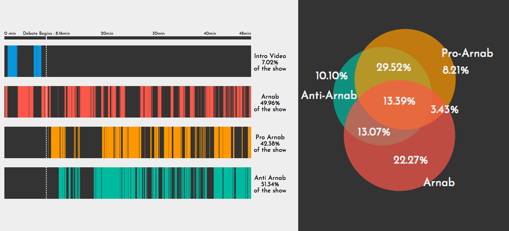

# Arnab is the Worst

Arnab Goswami, the editor in chief of Republic TV and Republic Bharat is 3 parts jingoism, 2 parts sycophancy, 1 part islamophobia blended together, and diluted with copious amounts of hate. Every night he hurts the Indian conscience with his venomous cacophony. I can go on and on about his chest-thumping pathetic excuse for journalism. But I shall refrain.

I've decided to collect as much data as possible and put it all in one place so that academics and enthusiasts can do visualizations, analysis or whatever else to show why Arnab should be taken seriously and why he is a dangerous component in the ongoing polarization of India.

---
**Today (April 23, 2020), I'm releasing 2 tiny datasets of Arnab's debate topics.**
- weekday_debates_06may2017_22april2020.csv
    - This has debate topics, hashtags, and dates from May 6th, 2017 to April 22nd, 2020. The urls are broken for most urls as it's also broken on their website.
- sunday_debates_22april2020.csv
    - This has debate topics, and urls for the Sunday night show
---
In the past, I have tried to do some things to highlight his modus operandi.

## 1. [Anatomy of a Debate (Data Story)](https://vivekaithal.co/shoutitout)

>Make no mistake, this is no debate show. It is WWE. It is entertainment. It is a Mortal Kombat cage match between a trishool wielding bhakt and a commie-sympathizing-sikular.
And it makes for really great TV.

## 2. [It's Time We Had The Talk (Youtube Video)](https://www.youtube.com/watch?v=XK7y3OsKQzY)

---

If you want any help in any Indian news/Arnab related project, you can message me on twitter at [@nuwandavek](https://twitter.com/nuwandavek)